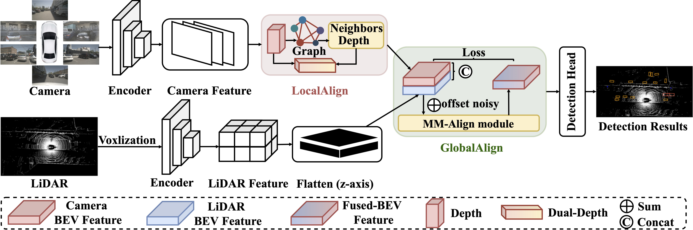
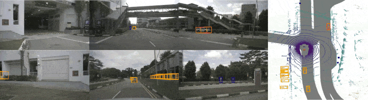

<div align="center">

# GraphBEV++

### Robust Camera-LiDAR Feature Alignment for 3D Object Detection

[](https://github.com/adept-thu/GraphBEVplus/tree/3DOD)
[](https://github.com/open-mmlab/OpenPCDet)
[](https://www.nuscenes.org/)
[](LICENSE)

**Ziying Song | Hongyu Pan | Lin Liu | Shaoqing Xu | Lei Yang | Caiyan Jia | Yadan Luo**

</div>

<p align="center">
  
</p>

## Overview

This is the official **3D object detection implementation** of GraphBEV++.
The `3DOD` branch is built on [OpenPCDet](https://github.com/open-mmlab/OpenPCDet)
and evaluates robust camera-LiDAR fusion on the nuScenes dataset.

GraphBEV++ addresses spatial and semantic misalignment between camera and LiDAR
BEV features with two complementary modules:

- **LocalAlign** enriches projected LiDAR depth with graph-based neighboring
  depth cues before lifting image features into BEV.
- **GlobalAlign** estimates feature offsets and refines multi-modal BEV fusion
  when camera and LiDAR representations are globally misaligned.

## Highlights

- Robust camera-LiDAR BEV fusion under calibration perturbations.
- Graph-based local depth alignment using projected LiDAR neighborhoods.
- Global BEV feature alignment before the 3D detection head.
- Four ready-to-use BEVFusion configurations for controlled ablations.
- OpenPCDet training, evaluation, visualization, and dataset tooling.

## Model Variants

All GraphBEV++ 3D detection configs are located in
[`tools/cfgs/nuscenes_models`](tools/cfgs/nuscenes_models).

| Config | View Transform | BEV Fuser | Description |
| --- | --- | --- | --- |
| `bevfusion.yaml` | `DepthLSSTransform` | `ConvFuser` | BEVFusion baseline |
| `bevfusion_graph.yaml` | `GraphDepthLSSTransform` | `ConvFuser` | LocalAlign |
| `bevfusion_deformable.yaml` | `DeformableDepthLSSTransform` | `ConvFuser` | Neighbor-depth attention |
| `bevfusion_graph_deformable.yaml` | `GraphDepthLSSTransform` | `GlobalAlign` | LocalAlign + GlobalAlign |

The main implementations are:

- [`pcdet/models/view_transforms/depth_lss_graph.py`](pcdet/models/view_transforms/depth_lss_graph.py)
- [`pcdet/models/view_transforms/depth_lss_graph_DeformableAttention.py`](pcdet/models/view_transforms/depth_lss_graph_DeformableAttention.py)
- [`pcdet/models/backbones_2d/fuser/GlobalAlign.py`](pcdet/models/backbones_2d/fuser/GlobalAlign.py)

## Results

Reported nuScenes-C results from the GraphBEV++ paper:

| Method | Clean mAP | Noisy mAP | Clean NDS | Noisy NDS | Relative mAP Drop |
| --- | ---: | ---: | ---: | ---: | ---: |
| BEVFusion-MIT | 68.5 | 60.8 | 71.4 | 65.7 | 11.2% |
| **GraphBEV++ (LSS)** | **70.7** | **69.3** | **73.2** | **72.3** | **2.0%** |

> The repository does not currently publish pretrained 3DOD checkpoints.
> Exact results depend on the selected config, checkpoint, data split, and
> calibration-noise settings.

## Installation

### Requirements

- Linux
- NVIDIA GPU and CUDA
- Python 3.6+
- PyTorch 1.1+
- A PyTorch/CUDA-compatible version of
  [spconv](https://github.com/traveller59/spconv)

The environment is inherited from OpenPCDet. A Python 3.8 environment is a
practical starting point:

```bash
git clone --branch 3DOD --single-branch https://github.com/adept-thu/GraphBEVplus.git
cd GraphBEVplus

conda create -n graphbevpp-3dod python=3.8 -y
conda activate graphbevpp-3dod

# Install PyTorch and spconv versions compatible with your CUDA installation.
pip install -r requirements.txt
pip install nuscenes-devkit==1.0.5 scipy
python setup.py develop
```

Verify the installation:

```bash
python -c "import torch, pcdet; print(torch.__version__); print(pcdet.__version__)"
```

See [`docs/INSTALL.md`](docs/INSTALL.md) for the upstream OpenPCDet installation
notes.

## Dataset Preparation

Download the full nuScenes dataset and organize it as follows:

```text
GraphBEVplus/
|-- data/
|   `-- nuscenes/
|       `-- v1.0-trainval/
|           |-- samples/
|           |-- sweeps/
|           |-- maps/
|           `-- v1.0-trainval/
|-- pcdet/
`-- tools/
```

Generate the **multi-modal** nuScenes information files:

```bash
python -m pcdet.datasets.nuscenes.nuscenes_dataset \
  --func create_nuscenes_infos \
  --cfg_file tools/cfgs/dataset_configs/nuscenes_dataset.yaml \
  --version v1.0-trainval \
  --with_cam
```

The `--with_cam` flag is required because the GraphBEV++ configs use both
camera images and LiDAR points.

## Before Training

Update the selected YAML config before launching an experiment:

1. Replace the absolute Swin-T checkpoint path under
   `MODEL.IMAGE_BACKBONE.INIT_CFG.checkpoint` with a valid local path.
2. Confirm `DATA_CONFIG.VERSION` and `DATA_CONFIG.INFO_PATH` match the intended
   train/validation/test split.
3. Set `MODEL.VTRANSFORM.Noise` according to the evaluation protocol.

Some checked-in configs target the nuScenes test split or contain an
author-specific absolute checkpoint path, so these fields must be reviewed.

## Training

Run commands from the `tools` directory.

### Single GPU

```bash
cd tools

python train.py \
  --cfg_file cfgs/nuscenes_models/bevfusion_graph_deformable.yaml \
  --batch_size 2 \
  --extra_tag graphbevpp
```

### Multiple GPUs

```bash
cd tools

python -m torch.distributed.launch \
  --nproc_per_node=8 \
  train.py \
  --launcher pytorch \
  --cfg_file cfgs/nuscenes_models/bevfusion_graph_deformable.yaml \
  --batch_size 16 \
  --extra_tag graphbevpp
```

Resume training from a checkpoint:

```bash
python train.py \
  --cfg_file cfgs/nuscenes_models/bevfusion_graph_deformable.yaml \
  --ckpt ../output/path/to/checkpoint_epoch_X.pth
```

## Evaluation

### Single GPU

```bash
cd tools

python test.py \
  --cfg_file cfgs/nuscenes_models/bevfusion_graph_deformable.yaml \
  --ckpt ../output/path/to/checkpoint_epoch_X.pth \
  --batch_size 1
```

### Multiple GPUs

```bash
cd tools

python -m torch.distributed.launch \
  --nproc_per_node=8 \
  test.py \
  --launcher pytorch \
  --cfg_file cfgs/nuscenes_models/bevfusion_graph_deformable.yaml \
  --ckpt ../output/path/to/checkpoint_epoch_X.pth \
  --batch_size 8
```

To evaluate all checkpoints in an experiment directory, use `--eval_all` and
`--ckpt_dir`.

## Calibration Noise

The view-transform implementations can inject calibration perturbations during
evaluation:

```yaml
MODEL:
  VTRANSFORM:
    Noise: True
```

- Set `Noise: False` for clean evaluation.
- Set `Noise: True` for the checked-in noisy evaluation behavior.
- Keep the setting identical when comparing model variants.

## Visualization

<p align="center">
  
</p>

OpenPCDet visualization utilities are available under
[`tools/visual_utils`](tools/visual_utils). Install Open3D when needed:

```bash
pip install open3d
```

See [`fig/README.md`](fig/README.md) for figure descriptions, previews, and
asset maintenance guidance.

## Repository Structure

```text
GraphBEVplus/
|-- .github/
|   `-- workflows/                       # GitHub Actions workflows
|-- docker/
|   `-- Dockerfile                       # Reference CUDA development image
|-- docs/
|   `-- guidelines_of_approaches/        # OpenPCDet guides and tutorials
|-- fig/
|   |-- README.md                        # Figure descriptions and usage
|   |-- main.png                         # GraphBEV++ method overview
|   `-- vis.gif                          # Detection visualization
|-- pcdet/
|   |-- datasets/
|   |   |-- argo2/
|   |   |   `-- argo2_utils/
|   |   |-- augmentor/
|   |   |-- custom/
|   |   |-- kitti/
|   |   |   `-- kitti_object_eval_python/
|   |   |-- lyft/
|   |   |   `-- lyft_mAP_eval/
|   |   |-- nuscenes/                    # GraphBEV++ training and evaluation data
|   |   |-- once/
|   |   |   `-- once_eval/
|   |   |-- pandaset/
|   |   |-- processor/
|   |   `-- waymo/
|   |-- models/
|   |   |-- backbones_2d/
|   |   |   |-- fuser/                   # ConvFuser and GlobalAlign
|   |   |   `-- map_to_bev/
|   |   |-- backbones_3d/
|   |   |   |-- focal_sparse_conv/
|   |   |   |   `-- SemanticSeg/
|   |   |   |-- pfe/
|   |   |   `-- vfe/
|   |   |       `-- image_vfe_modules/
|   |   |           |-- f2v/
|   |   |           `-- ffn/
|   |   |               |-- ddn/
|   |   |               `-- ddn_loss/
|   |   |-- backbones_image/             # Swin image backbone and image neck
|   |   |   `-- img_neck/
|   |   |-- dense_heads/                 # TransFusion and other detection heads
|   |   |   `-- target_assigner/
|   |   |-- detectors/                   # BEVFusion and OpenPCDet detectors
|   |   |-- model_utils/
|   |   |-- roi_heads/
|   |   |   `-- target_assigner/
|   |   `-- view_transforms/             # LSS, LocalAlign, and depth attention
|   |-- ops/
|   |   |-- bev_pool/
|   |   |   `-- src/
|   |   |-- ingroup_inds/
|   |   |   `-- src/
|   |   |-- iou3d_nms/
|   |   |   `-- src/
|   |   |-- pointnet2/
|   |   |   |-- pointnet2_batch/
|   |   |   |   `-- src/
|   |   |   `-- pointnet2_stack/
|   |   |       `-- src/
|   |   |-- roiaware_pool3d/
|   |   |   `-- src/
|   |   `-- roipoint_pool3d/
|   |       `-- src/
|   `-- utils/
|-- tools/
|   |-- cfgs/
|   |   |-- argo2_models/
|   |   |-- custom_models/
|   |   |-- dataset_configs/
|   |   |-- kitti_models/
|   |   |-- lyft_models/
|   |   |-- nuscenes_models/             # GraphBEV++ 3DOD model configs
|   |   |-- once_models/
|   |   `-- waymo_models/
|   |-- eval_utils/
|   |-- process_tools/
|   |-- train_utils/
|   |   `-- optimization/
|   |-- visual_utils/
|   |-- demo.py
|   |-- train.py
|   `-- test.py
|-- LICENSE
|-- metrics_summary.json
|-- requirements.txt
`-- setup.py
```

The following directories are required or generated locally and are not
included in the repository:

```text
GraphBEVplus/
|-- checkpoints/                         # Pretrained image backbone weights
|-- data/
|   `-- nuscenes/
|       `-- v1.0-trainval/               # Dataset and generated info files
`-- output/                              # Logs, checkpoints, and evaluations
```

## Citation

If GraphBEV++ is useful in your research, please cite:

```bibtex
@article{song2026graphbevplusplus,
  title   = {GraphBEV++: Multi-Modal Feature Alignment for Autonomous Driving},
  author  = {Song, Ziying and Pan, Hongyu and Liu, Lin and Xu, Shaoqing and
             Yang, Lei and Jia, Caiyan and Luo, Yadan},
  journal = {International Journal of Computer Vision},
  year    = {2026}
}
```

## Acknowledgements

This implementation is built on
[OpenPCDet](https://github.com/open-mmlab/OpenPCDet) and incorporates ideas and
components from [BEVFusion](https://github.com/mit-han-lab/bevfusion).

## License

This project is released under the [Apache License 2.0](LICENSE).
