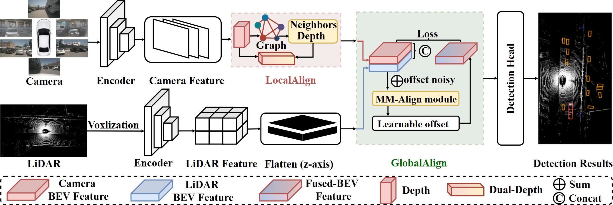
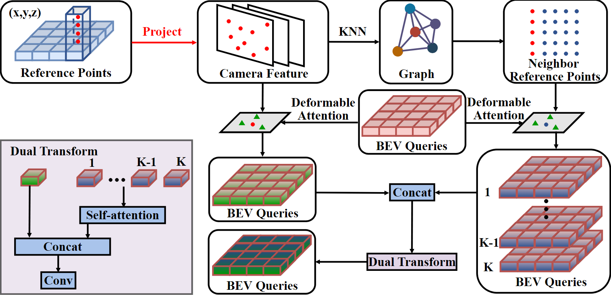

# GraphBEV++: Multi-Modal Feature Alignment for Autonomous Driving

This repository contains resources related to the **end-to-end autonomous driving** of the paper "GraphBEV++: Multi-Modal Feature Alignment for Autonomous Driving".

## Overview
GraphBEV++ is a approache to mitigate feature misalignment caused by inaccurate calibration. Its effectiveness is validated for multi-sensor detection and end-to-end autonomous driving.
### Detection

Detail and resouces can be found in [GraphBEV](https://github.com/adept-thu/GraphBEV).

### End-to-end autonomous driving
#### GraphBEV++(LSS)

#### GraphBEV++(Query)

GraphBEV++(Query) is based on [UniAD](https://github.com/OpenDriveLab/UniAD) and its multi-modal version based on [FusionAD](https://github.com/SJSU-AD/FusionAD).

## Paper

For more details, please refer to the [full paper](#). 

## Getting Started
- [Installation](docs/INSTALL.md)
- [Prepare Dataset](docs/DATA_PREP.md)
- [Train/Eval](docs/TRAIN_EVAL.md)

## Main Results
∗ denotes evaluation using checkpoints from official implementation.

| Method   | Detection (mAP, NDS) | Tracking (AMOTA, AMOTP) | Mapping (IoU-Lane, IoU-D) | Prediction (ADE, FDE, MR, EPA)  | Occupancy (VPQ-n, VPQ-f, IoU-n, IoU-f) | Planning (DE, CR(avg), CR(traj) |
|----------|----------------------|-------------------------|---------------------------|---------------------------------|----------------------------------------|---------------------------------|
| UniAD    | 0.382*, 0.499*       | 0.359, 1.320            | 0.313, 0.691              | 0.708, 1.025, 0.151, 0.456      | 54.7, 33.5, 63.4, 40.2                 | 1.03, 0.31, 1.46*               |
| FusionAD | 0.574, 0.646 | 0.501, 1.065    | 0.367, 0.731      | 0.389, 0.615, 0.084, 0.620  | 64.7, 50.2, 70.4, 51.0             | 0.81, 0.12, 0.37            |
| GraphBEV++ |  |  |  |  | |  |


### Motion Forecasting Results

| Method | minADE | minFDE | MR | EPA |
| --- | --- | --- | --- | --- |
| PnPNet | 1.15 | 1.95 | 0.226 | 0.222 |
| VIP3D | 2.05 | 2.84 | 0.246 | 0.226 |
| UniAD | 0.71 | 1.02 | 0.151 | 0.456 |
| FusionAD | 0.388 | 0.617 | 0.086 | 0.626 |
| GraphBEV++ | | | | |

### Occupancy Prediction Results

| Method | IoU-n | IoU-f | VPQ-n | VPQ-f |
| --- | --- | --- | --- | --- |
| FIERY | 59.4 | 36.7 | 50.2 | 29.9 |
| StretchBEV | 55.5 | 37.1 | 46.0 | 29.0 |
| ST-P3 | - | 38.9 | - | 32.1 |
| BEVerse | 61.4 | 40.9 | 54.3 | 36.1 |
| PowerBEV | 62.5 | 39.3 | 55.5 | 33.8 |
| UniAD | 63.4 | 40.2 | 54.7 | 33.5 |
| FusionAD | 71.2 | 51.5 | 65.5 | 51.1 |
 GraphBEV++ | | | | |

### Noise Results


### Planning Results

| ID           | DE_avg   | CR_1s | CR_2s | CR_3s | CR_avg | CR_traj  |
|--------------|----------| --- | --- | --- | --- |----------|
| FF           | 1.43     | 0.06 | 0.17 | 1.07 | 0.43 | -        |
| EO           | 1.60     | 0.04 | 0.09 | 0.88 | 0.33 | -        |
| ST-P3        | 2.11     | 0.23 | 0.62 | 1.27 | 0.71 | -        |
| UniAD        | 1.03     | 0.05 | 0.17 | 0.71 | 0.31 | 1.46     |
| VAD          | 0.37 | 0.07 | 0.10 | 0.24 | 0.14 | -        |
| FusionAD | 0.81     | 0.02 | 0.08 | 0.27 | 0.12 | 0.37 |
 GraphBEV++ | | | | | | |


## Citation
If you find our work useful in your research, please consider citing:

```bibtex
@article{song2024graphbev,
  title={Graphbev: Towards robust bev feature alignment for multi-modal 3d object detection},
  author={Song, Ziying and Yang, Lei and Xu, Shaoqing and Liu, Lin and Xu, Dongyang and Jia, Caiyan and Jia, Feiyang and Wang, Li},
  journal={arXiv preprint arXiv:2403.11848},
  year={2024}
}
@article{song2024graphbev++,
  title={GraphBEV++: Multi-Modal  Feature Alignment for Autonomous Driving},
  author={Ziying Song, Hongyu Pan, Lin Liu, Yadan Luo, Guoxin Zhang, Lei Yang, Caiyan Jia, and Shaoshuai Shi},
  year={2024}
}
```

## Acknowledgements

We acknowledge the authors of [UniAD](https://github.com/OpenDriveLab/UniAD) and [FusionAD](https://github.com/westlake-autolab/FusionAD) repository for their valuable contribution.