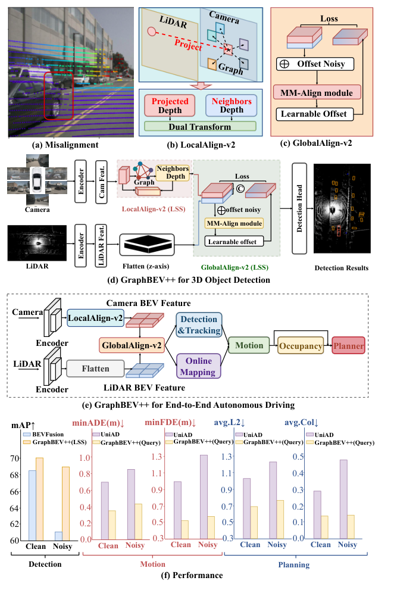
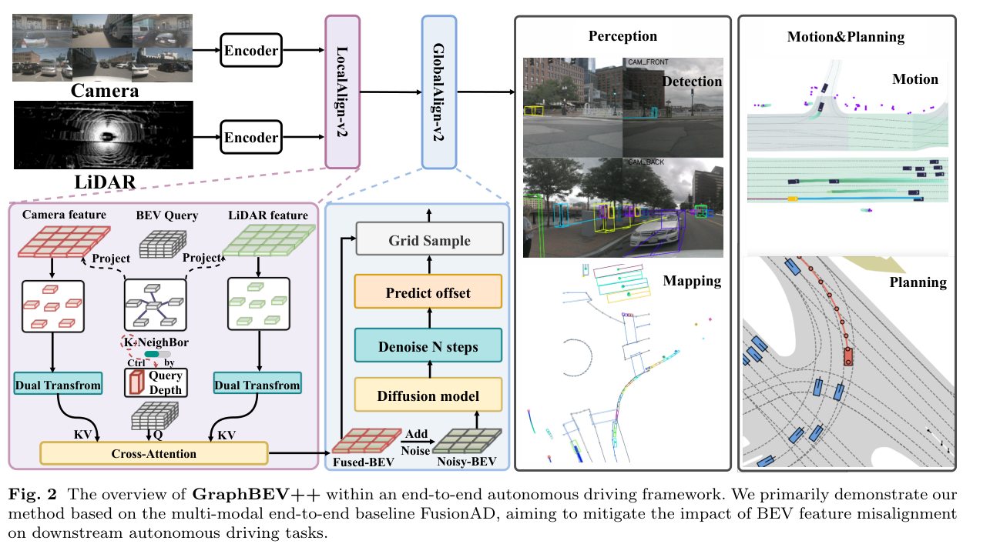
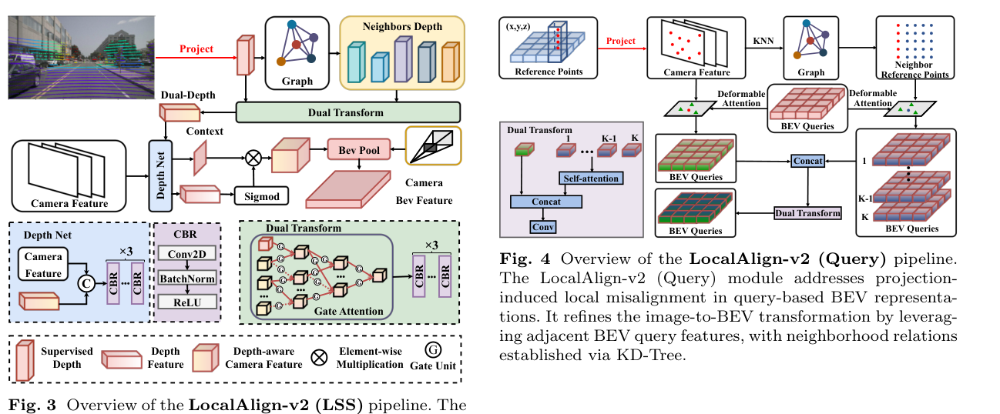
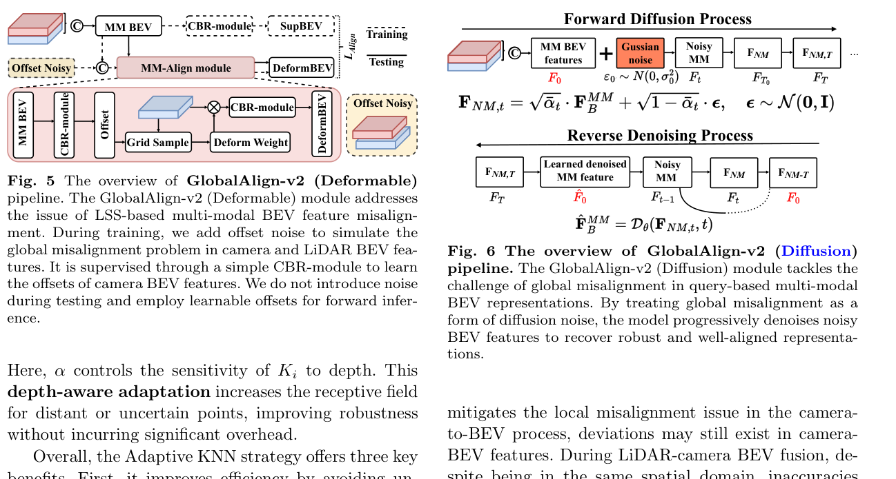
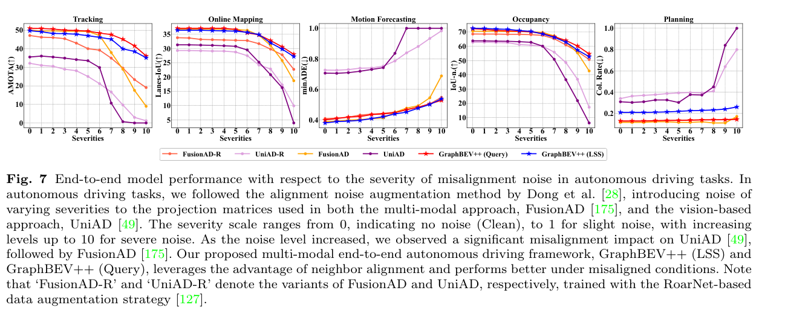

<div align="center">

# GraphBEV++

### Multi-Modal Feature Alignment for Autonomous Driving

[](./paper.pdf)
[](https://github.com/adept-thu/GraphBEVplus)
[](./index.html)

**Ziying Song · Hongyu Pan · Lin Liu · Shaoqing Xu · Lei Yang · Caiyan Jia · Yadan Luo**

</div>

<p align="center">
  
</p>

## Overview

GraphBEV++ is a unified multi-modal feature alignment framework for robust
autonomous driving. It addresses the spatial and semantic misalignment between
camera and LiDAR BEV features caused by calibration noise, inaccurate
projection, and heterogeneous feature representations.

The framework combines two complementary components:

- **LocalAlign-v2** corrects local correspondence errors during BEV
  construction through neighborhood-aware graph matching.
- **GlobalAlign-v2** resolves accumulated representation-level inconsistencies
  during BEV fusion through deformable alignment or diffusion-based denoising.

GraphBEV++ supports both dense LSS-based and sparse query-based BEV
representations, and generalizes across 3D detection, tracking, prediction,
occupancy estimation, and end-to-end planning.

## Highlights

- **Unified alignment:** corrects misalignment at both BEV construction and
  feature fusion stages.
- **Cross-paradigm design:** supports LSS-based and query-based BEV
  representations.
- **Noise robustness:** retains strong detection performance under sensor
  calibration perturbations.
- **Task generalization:** improves perception, prediction, occupancy, and
  planning tasks.
- **Practical efficiency:** the LSS variant reaches 7.1 FPS on an NVIDIA A100
  with limited alignment overhead.

## Method

<p align="center">
  
</p>

| Component | Stage | Purpose | Variants |
| --- | --- | --- | --- |
| **LocalAlign-v2** | BEV construction | Refines inaccurate projection and reference-point correspondence using neighborhood context | LSS, Query |
| **GlobalAlign-v2** | BEV fusion | Aligns spatial shifts and semantic inconsistencies between heterogeneous BEV features | Deformable, Diffusion |

<p align="center">
  
  
</p>

## Main Results

### Robust 3D Detection on nuScenes-C

| Method | Clean mAP | Noisy mAP | Clean NDS | Noisy NDS | Relative mAP Drop |
| --- | ---: | ---: | ---: | ---: | ---: |
| BEVFusion-MIT | 68.5 | 60.8 | 71.4 | 65.7 | 11.2% |
| SparseFusion | 70.4 | 64.7 | 72.8 | 67.1 | 8.1% |
| **GraphBEV++ (LSS)** | 70.7 | **69.3** | 73.2 | **72.3** | **2.0%** |
| **GraphBEV++ (Query)** | **71.4** | 69.1 | **73.4** | 71.2 | 3.2% |

### End-to-End Autonomous Driving

| Method | AMOTA | minADE | minFDE | MR | EPA |
| --- | ---: | ---: | ---: | ---: | ---: |
| UniAD | 35.9 | 0.71 | 1.02 | 15.1 | 45.6 |
| FusionAD | 50.1 | 0.39 | 0.62 | 8.6 | 62.6 |
| **GraphBEV++ (LSS)** | 49.8 | 0.40 | 0.59 | 8.5 | **64.7** |
| **GraphBEV++ (Query)** | **51.1** | **0.38** | **0.52** | **7.7** | 64.5 |

<p align="center">
  
</p>

## Official Implementation

The training and evaluation code is maintained in the official
[GraphBEVplus repository](https://github.com/adept-thu/GraphBEVplus).

```bash
git clone https://github.com/adept-thu/GraphBEVplus.git
cd GraphBEVplus
```

Follow the upstream guides to prepare the environment and nuScenes dataset:

- [Installation](https://github.com/adept-thu/GraphBEVplus/blob/main/resources/INSTALL.md)
- [Dataset preparation](https://github.com/adept-thu/GraphBEVplus/blob/main/resources/DATA_PREPARE.md)
- [Training and evaluation](https://github.com/adept-thu/GraphBEVplus/blob/main/docs/TRAIN_EVAL.md)

Train the published query-based configuration on four GPUs:

```bash
CUDA_VISIBLE_DEVICES=0,1,2,3 \
bash tools/dist_train.sh projects/configs/query_graphbev/graphbev_query.py 4
```

Evaluate a checkpoint:

```bash
CUDA_VISIBLE_DEVICES=0,1,2,3 \
bash tools/dist_test.sh projects/configs/query_graphbev/graphbev_query.py \
path/to/checkpoint.pth 4 --eval bbox
```

## Project Page

This repository also provides a dependency-free academic project page.

```text
.
|-- index.html          # Project page
|-- style.css           # Page styles
|-- script.js           # Tabs and citation-copy interaction
|-- resources/             # Method and result figures
|-- paper.pdf           # Paper
`-- README.md
```

Open `index.html` directly for a local preview. To publish with GitHub Pages,
open the repository's **Settings > Pages**, select **Deploy from a branch**,
and choose the default branch with `/ (root)`.


## Acknowledgements

The implementation builds on the OpenMMLab ecosystem and related BEV
perception research, including BEVFusion, BEVFormer, and SparseFusion. Please
also consider citing these works when using their code or configurations.

## License

Please refer to the license and third-party notices in the
[official implementation](https://github.com/adept-thu/GraphBEVplus).
